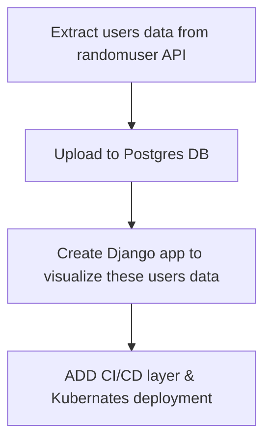

# 🛠️ Django + Airflow + Postgres – CI/CD + Kubernetes

🚀 Projet DevOps/Data Engineering complet avec Django, Airflow, PostgreSQL, Docker, CI/CD GitHub Actions et déploiement Kubernetes via Minikube.

---

## 📌 Objectifs

- Développer une application Django qui expose une API `/users/`
- Extraire des utilisateurs fictifs depuis une API(randomuser) externe via Airflow (ELT)
- Sauvegarder les utilisateurs dans une base PostgreSQL
- Automatiser le pipeline CI/CD avec GitHub Actions
- Déployer l'application dans un cluster Kubernetes (local avec Minikube)

---

## 🧱 Stack utilisée

| Outil           | Rôle                                  |
|----------------|----------------------------------------|
| Django          | Web app & API                         |
| PostgreSQL      | Base de données relationnelle         |
| Airflow         | Orchestration du pipeline ELT         |
| Docker / Compose| Conteneurisation locale               |
| GitHub Actions  | CI/CD : build, test, push             |
| Kubernetes (Minikube) | Orchestration, déploiement K8s       |
| Ingress         | Accès à l’application via nom local   |

---

## 🔁 Pipeline Flow



---

## ⚙️ Fonctionnalités

- `GET /users/` : renvoie la liste des utilisateurs depuis la base
- DAG Airflow `user_etl_dag` :
  - 📥 `extract` → API randomuser.me
  - 💾 `load` → table `user_profile` dans Postgres
- CI/CD automatisé : build image Docker + push vers Docker Hub
- Déploiement sur Kubernetes avec :
  - `Deployment`, `Service`, `ConfigMap`, `Ingress`
  - accès via [http://django.local](http://django.local)

---

## 🛠️ Lancer le projet en local

### 🔹 Avec Docker Compose

```bash
docker-compose up --build
```
Accès: http://localhost:8000/users

Interface Airflow:
```bash
    http://localhost:8085
```
## ☁️ CI/CD GitHub Actions
Image buildée automatiquement sur chaque push main

Poussée vers Docker Hub : aidasow73/django-airflow-app

## ☸️ Déploiement Kubernetes (Minikube)
### ✅ Lancer Minikube et builder l’image
```bash
    minikube start --driver=docker
    eval $(minikube docker-env)
    docker build -t django-airflow-app:latest ./web
```
### ✅ Déployer
```bash
    kubectl apply -f k8s/
    minikube tunnel
```

Ajouter dans /etc/hosts:
```bash
    127.0.0.1 django.local
```
Accès via: Accès via http://django.local

## Screnshots:


## 📌 À venir (v2)
✅ Déploiement sur un cluster cloud (GKE, DO, etc.)

✅ Monitoring (Prometheus + Grafana)

✅ Helm Chart


